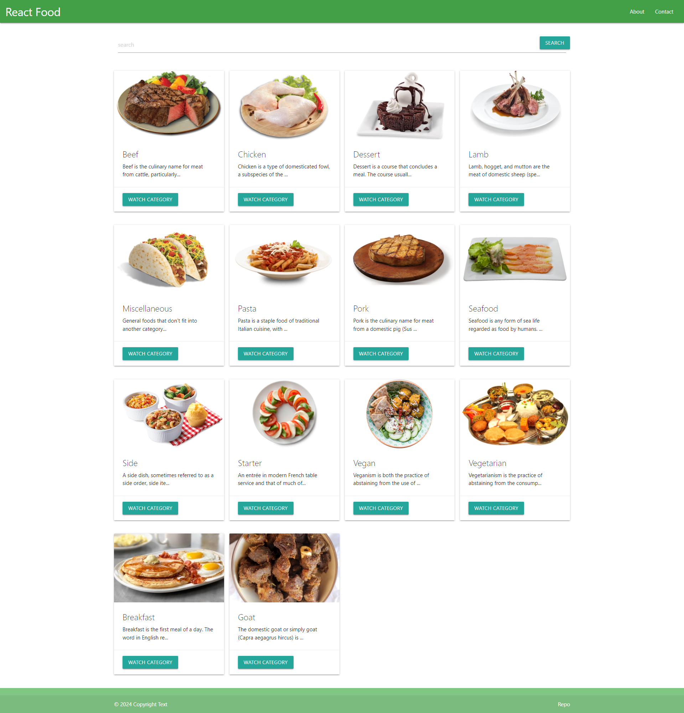

## React spa приложение по поиску и просмотру рецептов различных блюд

 - ### Проект доступен по ссылке - https://vadim-strakhov.github.io/react_project_food/
 - ### В проекте использован бесплатный API - https://themealdb.com/api.php
 - ### В проекте реализован функционал выбора нужной категории и просмотр рецепта конкретного блюда. Так же реализован поиск по нужной категории, например 'Dessert' или 'Pasta'
 - ### Технологии - `react`, `css`, `ajax`, `fetch-api`, `react-router-dom`, `materialize-css` 

